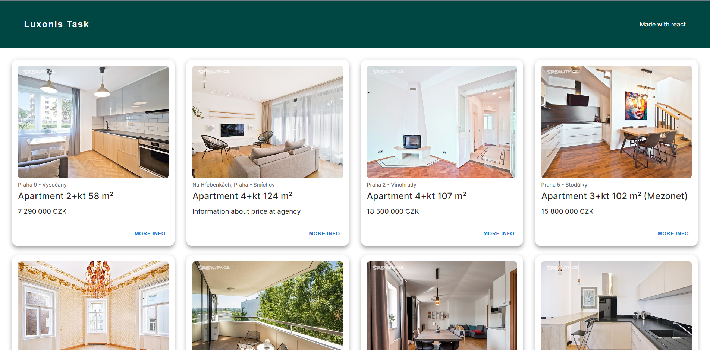
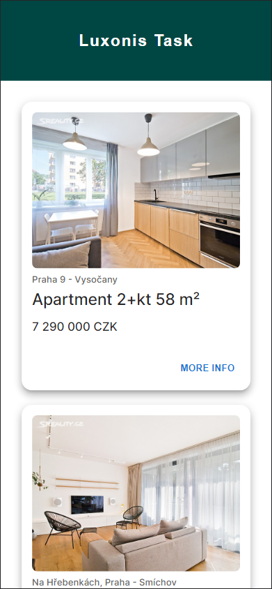

# Luxonis interview task

## Instructions

Scrape the first 500 items (title, image url) from https://www.sreality.cz/en
(flats, sell - you can switch the web to English) and save it in the Postgresql database.
Implement a simple HTTP server (or use Nginx) and show these 500 items on a nice page (with pagination)
which will use your own design and put everything to single docker-compose command
so that I can just run "docker-compose up" in the Github repository
and see the scraped ads on http://127.0.0.1:8080 page.
The solution must be written in Typescript & React.

## Step by step

1. I scraped the flat ads from https://www.sreality.cz/en using the
[Web Scraper](https://chrome.google.com/webstore/detail/web-scraper-free-web-scra/jnhgnonknehpejjnehehllkliplmbmhn) Chrome extension. 
2. Because the scraped .csv file had too much useless information, I processed the data using Python and Pandas. The data was then
exported to a .csv file and ready to be added to database.
3. I added the data to the database using 
the

`COPY apartments (link, title, location, price, image) FROM '/data.csv' DELIMITER ',' CSV;` 

command.
4. For database queries I developed a simple Spring Boot backend with a single endpoint

`http://localhost:5000/apartments/getAll`

that returns a list of apartments, based on the page number and size provided by the request. This means that
the pagination was done on the backend of the application.

5. To present the data I developed a simple React application using [Vite](https://vitejs.dev/). I used [axios](https://axios-http.com/) for fetching the data
and [MaterialUI](https://mui.com/) for styling and the Pagination component.

6. When everything was working locally I added the Dockerfiles and docker-compose.yml file to containerize everything.

## Usage

### Prerequisites

- Docker

### Installation

1. Clone the repository
2. Run `docker-compose up` in the root directory to start the containers.
3. Navigate to  http://127.0.0.1:8080 to view the page